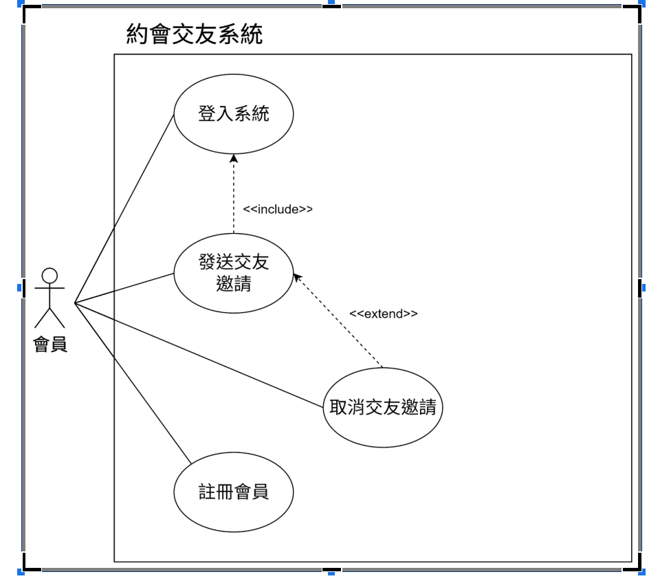
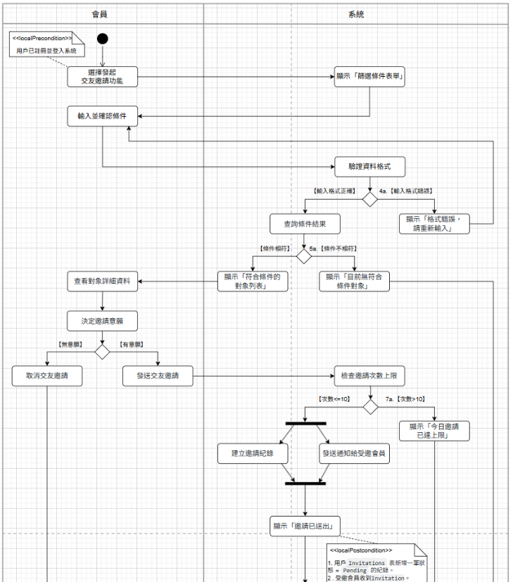
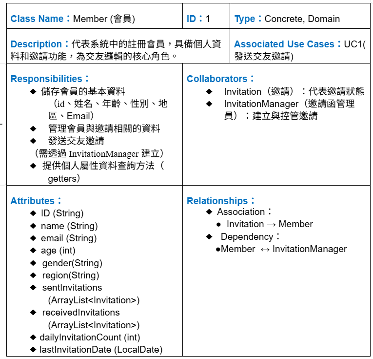
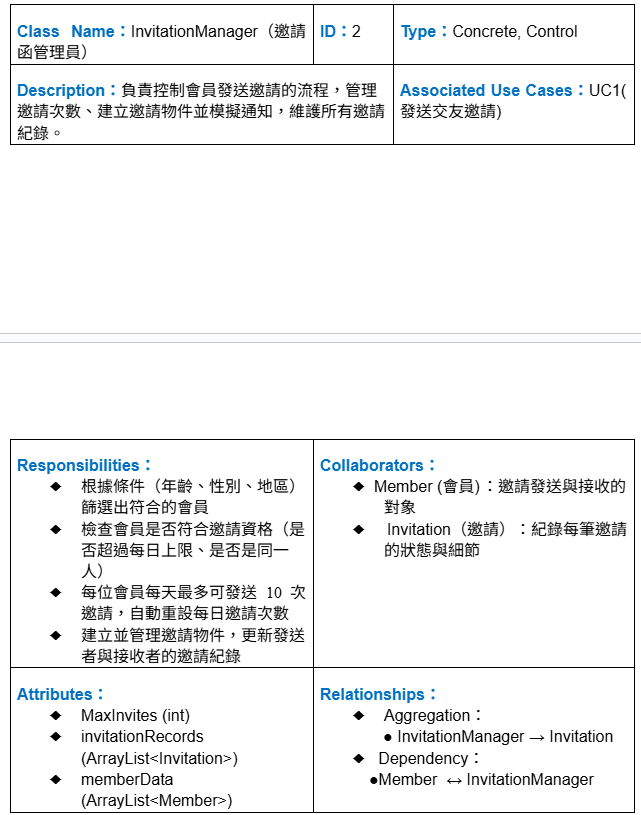
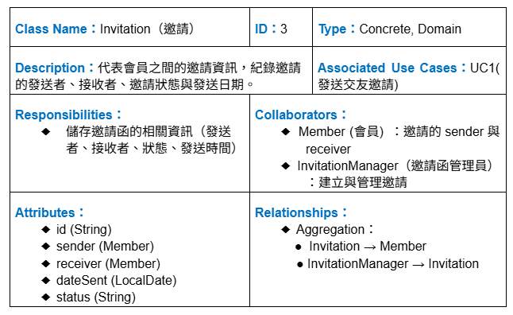
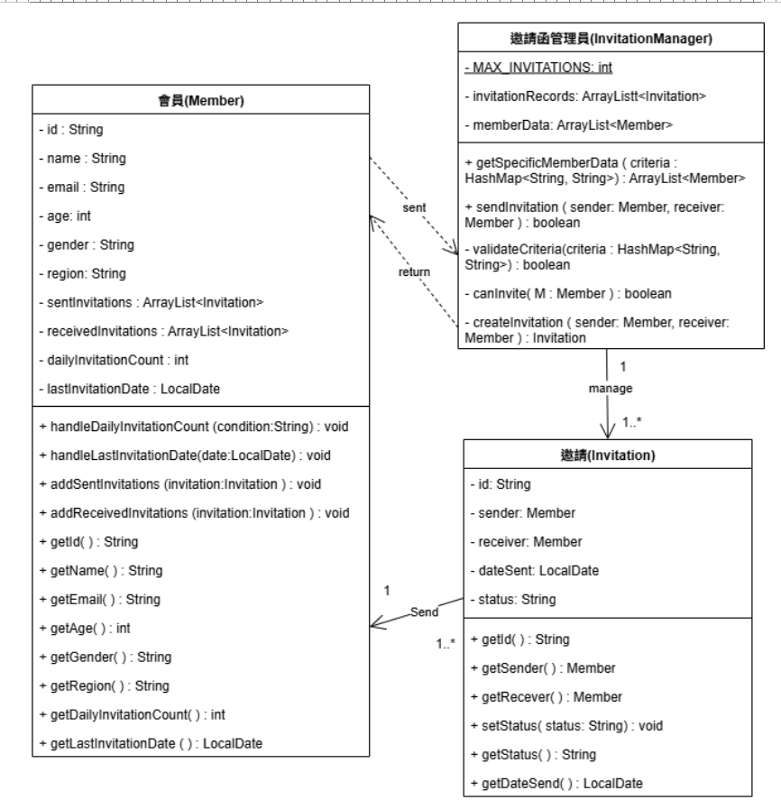
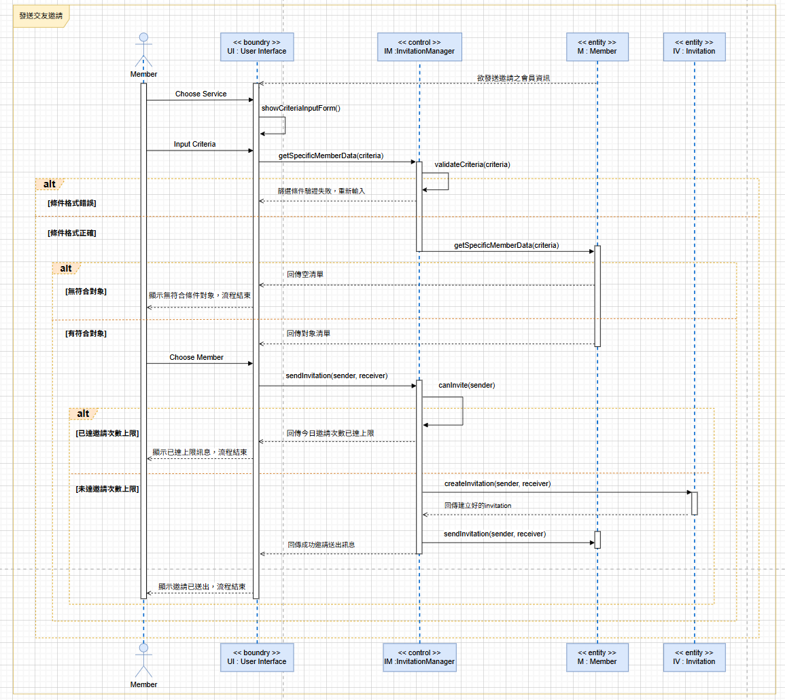

# UCD

# 規格書
## Use Case Specification — 發送交友邀請

| **欄位** | **內容** |
|---|---|
| **Use Case Name** | 發送交友邀請 |
| **Primary Actor** | Member |
| **Brief Description** | 用戶設定對象篩選條件後，系統顯示符合條件的對象列表。用戶選擇屬意對象後送出交友邀請，系統建立邀請記錄並通知受邀會員。 |
| **Relationships ：Association** | <ul><li>系統會員</li><li>系統本身</li></ul> |
| **Relationships ：Include** | <ul><li>登入系統</li></ul> |
| **Relationships ：Extend** | <ul><li>取消交友邀請</li></ul> |
| **Preconditions** | 用戶已註冊並登入系統 |
| **Normal Flow of Events** | <ol><li>會員進入系統選擇發起交友邀請功能。</li><li>系統顯示篩選條件輸入畫面。</li><li>會員輸入篩選條件。</li><li>系統驗證條件格式是否正確。</li><li>系統執行查詢並顯示符合條件的對象列表。</li><li>會員選擇對象送出邀請。</li><li>系統驗證是否超過當日邀請次數。</li><li>系統建立邀請記錄，標記邀請對象並通知受邀會員。</li><li>系統顯示「邀請已送出」。</li></ol> |
| **Postconditions** | <ol><li>用戶 Invitations 表中新增一筆狀態為 <code>Pending</code> 的記錄。</li><li>受邀會員收到系統寄送的 Invitation。</li></ol> |
| **Alternate / Exceptional Flows** | <ul><li><strong>4a.</strong> 若輸入條件錯誤，系統顯示「格式錯誤，請重新輸入」，返回輸入條件頁面。</li><li><strong>5a.</strong> 若查無符合條件對象，系統顯示「目前無符合條件對象」，流程結束。</li><li><strong>7a.</strong> 若發送邀請次數達當日上限，系統顯示「今日邀請次數已達上限」，流程結束。</li></ul> |
| **Special Requirements** | 單一會員每日最多 10 則邀請，超過則提示已達上限。 |

# 活動圖

# CRC

# 類別圖

# 循序圖
